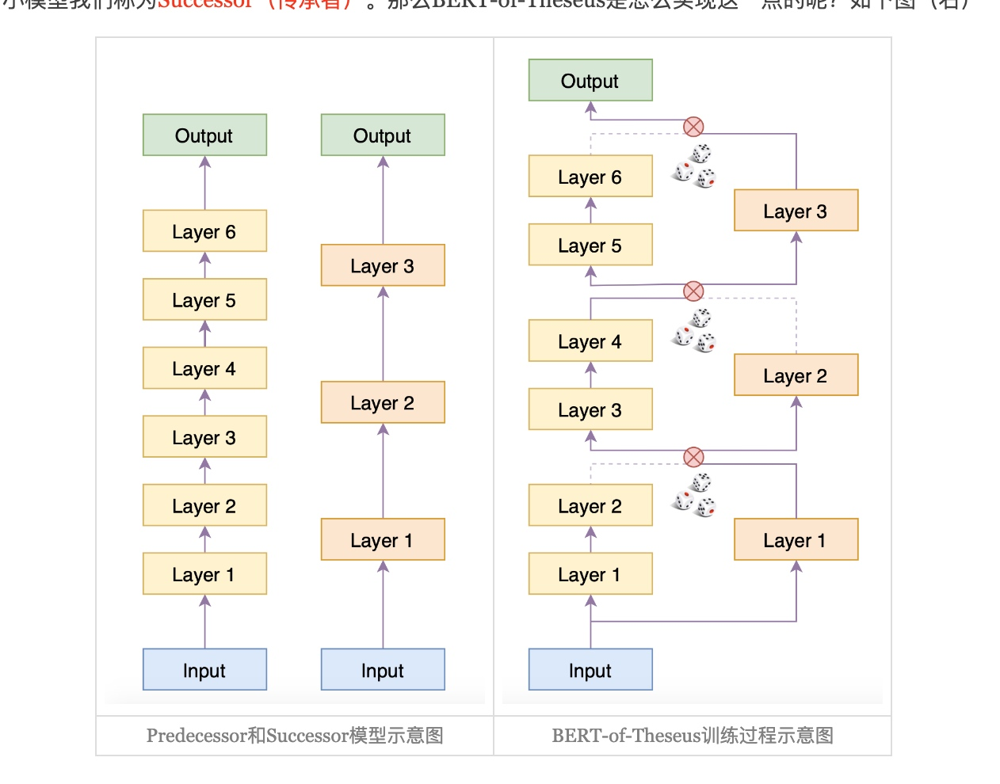

# BERT-of-Theseus
论文标题: BERT-of-Theseus: Compressing BERT by Progressive Module Replacing
作者: Canwen Xu, Wangchunshu Zhou, Tao Ge, Furu Wei, Ming Zhou
时间: 2020
核心算法名: BERT-of-Theseus
论文链接: [https://arxiv.org/abs/2002.02925](https://arxiv.org/abs/2002.02925)
参考: [科学空间](https://chat.openai.com/c/4b9f76af-42bc-47a4-90e6-cfe71e980e0c)

## 背景
随着深度学习的普及，许多大型神经模型被提出并在各个领域取得了最先进的性能。特别是在自然语言处理（NLP）中，预训练和微调已经成为大多数任务的新规范。基于Transformer的预训练模型在自然语言理解（NLU）和自然语言生成（NLG）领域都占据了主导地位。这些模型受益于其“超参数化”的特性，并包含数百万甚至数十亿的参数，使其在计算成本和效率方面都显得过于昂贵和低效。

## 解决问题
为了解决这个问题，论文提出了一种新的模型压缩方法，通过逐步替换模块来有效地压缩BERT。该方法首先将原始的BERT划分为几个模块，并构建它们的紧凑替代品。然后，我们随机地用它们的替代品替换原始模块来训练紧凑模块以模仿原始模块的行为。我们逐渐增加替换的概率。这种方式使我们的方法在原始和紧凑模型之间带来了更深层次的交互。
<!-- more -->
## 相关工作
为了解决这个问题，已经提出了许多技术来压缩神经网络。一般来说，这些技术可以分为量化、权重剪枝和知识蒸馏。其中，知识蒸馏在压缩预训练语言模型方面受到了很多关注。知识蒸馏利用一个大的教师模型来“教”一个紧凑的学生模型来模仿教师的行为。这样，教师模型中的知识就可以被转移到较小的模型中。

## 核心方法和步骤

1. 将原始的BERT模型划分为几个模块，并为每个模块构建紧凑的替代品。
    - 1.1 随机地用它们的替代品替换原始模块来训练紧凑模块以模仿原始模块的行为。
    - 1.2 逐渐增加替换的概率。
2. 在训练过程中，原始模型和紧凑模型一起工作，可能产生梯度级别的交互。不同的模块排列混合了前任和继任模块，可能增加了额外的正则化，类似于Dropout。

## 工作对比
- 与知识蒸馏相比，这种方法只使用了任务特定的损失函数。然而，基于知识蒸馏的方法使用任务特定的损失，以及一个或多个蒸馏损失作为其优化目标。
- 与最近的工作不同，Theseus Compression并没有使用Transformer特定的特性进行压缩，因此有可能压缩广泛的模型。
- 与知识蒸馏不同，这种方法允许原始模型与压缩后的继任模型一起工作，可能产生梯度级别的交互。此外，混合前任和继任模块的不同模块排列可能增加了额外的正则化，类似于Dropout。

## 对比效果
- 压缩后的BERT模型在保留原始模型超过98%的性能的同时，速度提高了1.94倍，超过了其他基于知识蒸馏的压缩基线。