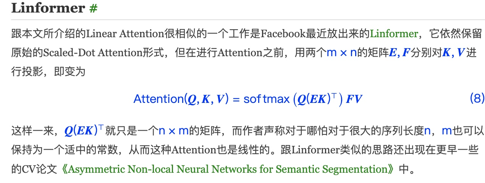

# Linear Attention
链接：[https://spaces.ac.cn/archives/7546](https://spaces.ac.cn/archives/7546)

## 背景
Attention机制在自然语言处理（NLP）和计算机视觉（CV）中得到了广泛的应用。然而，标准的Attention机制的计算复杂度为O(n^2)，这在处理长序列时会带来问题。因此，研究者们提出了各种方法来降低Attention的计算复杂度，包括稀疏Attention、Reformer、Linformer等。

## 解决问题
本文主要探讨了如何通过去掉Softmax来实现线性Attention，即将Attention的计算复杂度降低到O(n)。
<!-- more -->
## 相关工作
- 稀疏Attention：通过限制每个token只能关注到固定数量的其他token，从而降低Attention的计算复杂度。
- Reformer：通过使用Locality-Sensitive Hashing (LSH) 和可逆网络来降低显存占用量。而是通过LSH（Locality Sensitive Hashing）技术（近似地）快速地找到最大的若干个Attention值，然后只去计算那若干个值。

- Linformer：通过在进行Attention之前，用两个矩阵对K和V进行投影，从而降低Attention的计算复杂度。

## 核心方法和步骤
1. 替换相似函数，将原来的权重e^{q_i^T k_j}替换为sim(q_i, k_j)，其中sim(q_i, k_j)是q_i和k_j的一般函数，要求sim(q_i, k_j) >= 0。
    - 1.1 为了保留Attention相似的分布特性，我们要求sim(q_i, k_j) >= 0。
2. 替换softmax，通过去掉Softmax，将原来的q @ (k @ v)改为(q @ k) @ v，从而将Attention的计算复杂度降低到O(n)。

## 工作对比
- 与稀疏Attention和Reformer相比，本文的方法更简单，不需要复杂的实现。
- 与Linformer相比，本文的方法可以做到Causal Masking，因此可以用于语言模型、Seq2Seq等自回归生成任务。

