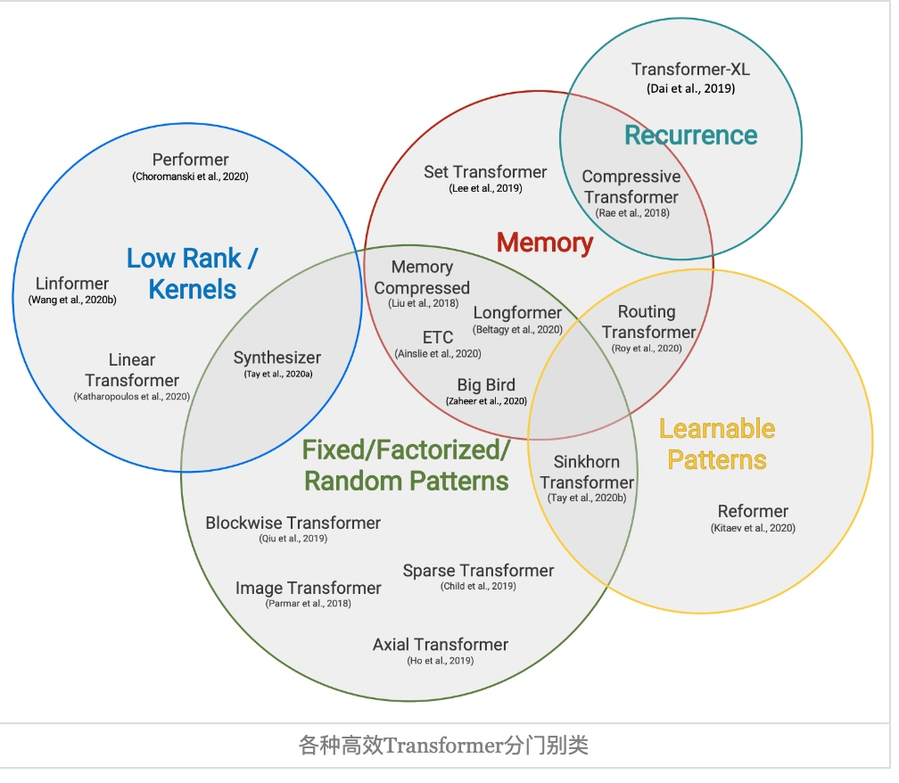
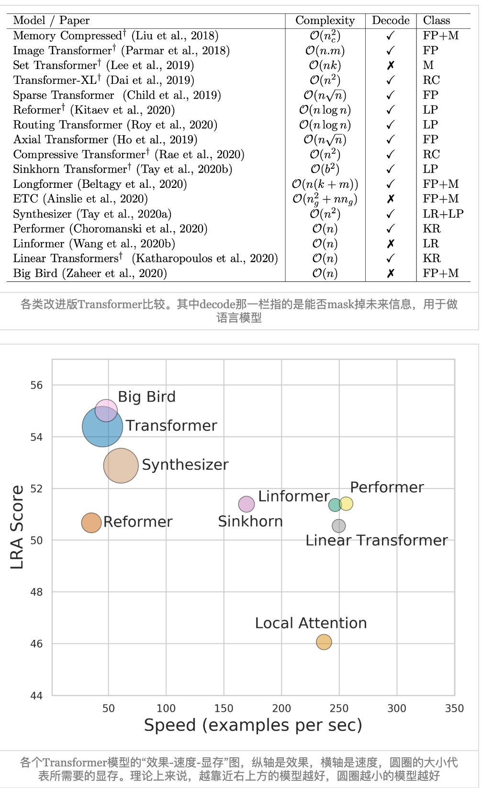

# Performer - Google & University of Cambridge
论文标题：Rethinking Attention with Performers  
作者：Krzysztof Choromanski, Valerii Likhosherstov, David Dohan, Xingyou Song, Andreea Gane, Tamas Sarlos, Peter Hawkins, Jared Davis, Afroz Mohiuddin, Lukasz Kaiser, David Belanger, Lucy Colwell, Adrian Weller  
时间：2021  
核心算法名：Performer  
论文链接：[arXiv:2009.14794v4](https://arxiv.org/abs/2009.14794)

## 背景
Transformer架构在机器学习的多个领域中都取得了最先进的结果，包括自然语言处理、神经机器翻译、文档生成/摘要、时间序列预测、生成建模（如图像生成）、音乐生成和生物信息学等。然而，Transformer的计算复杂度随着输入序列的长度呈二次增长，这对于处理大规模序列的任务来说是不可接受的。为了解决这个问题，研究者们提出了多种方法，如限制注意力机制只关注局部邻域，或者引入稀疏性、池化压缩、聚类/分箱/卷积技术等结构先验。


## 解决问题
Performer是一种新的Transformer架构，它能够以可证明的准确性估计常规（softmax）全秩注意力Transformer，但只使用线性（而不是二次）的空间和时间复杂度，而且不依赖于任何先验知识，如稀疏性或低秩性。为了近似softmax注意力核，Performer使用了一种新的通过正交随机特征进行快速注意力（FAVOR+）的方法，这可能对可扩展的核方法具有独立的兴趣。FAVOR+还可以用于有效地模拟超出softmax的可核化注意力机制。
<!-- more -->
## 相关工作
Transformer架构在机器学习的多个领域中都取得了最先进的结果，包括自然语言处理、神经机器翻译、文档生成/摘要、时间序列预测、生成建模（如图像生成）、音乐生成和生物信息学等。然而，Transformer的计算复杂度随着输入序列的长度呈二次增长，这对于处理大规模序列的任务来说是不可接受的。为了解决这个问题，研究者们提出了多种方法，如限制注意力机制只关注局部邻域，或者引入稀疏性、池化压缩、聚类/分箱/卷积技术等结构先验。

## 核心方法和步骤

``` math
 \begin{equation}\begin{aligned} 
e^{\boldsymbol{q}\cdot \boldsymbol{k}}&=\mathbb{E}_{\boldsymbol{\omega}\sim \mathcal{N}(\boldsymbol{\omega};0,\boldsymbol{1}_d)}\left[e^{\boldsymbol{\omega}\cdot \boldsymbol{q}-\Vert \boldsymbol{q}\Vert^2 / 2} \times e^{\boldsymbol{\omega}\cdot \boldsymbol{k}-\Vert \boldsymbol{k}\Vert^2 / 2}\right]\\[6pt] 
&\approx\underbrace{\frac{1}{\sqrt{m}}\begin{pmatrix}e^{\boldsymbol{\omega}_1\cdot \boldsymbol{q}-\Vert \boldsymbol{q}\Vert^2 / 2} \\ 
e^{\boldsymbol{\omega}_2\cdot \boldsymbol{q}-\Vert \boldsymbol{q}\Vert^2 / 2}\\ 
\vdots\\ 
e^{\boldsymbol{\omega}_m\cdot \boldsymbol{q}-\Vert \boldsymbol{q}\Vert^2 / 2} \end{pmatrix}}_{\tilde{\boldsymbol{q}}} 
\cdot  \underbrace{\frac{1}{\sqrt{m}}\begin{pmatrix}e^{\boldsymbol{\omega}_1\cdot \boldsymbol{k}-\Vert \boldsymbol{k}\Vert^2 / 2} \\ 
e^{\boldsymbol{\omega}_2\cdot \boldsymbol{k}-\Vert \boldsymbol{k}\Vert^2 / 2}\\ 
\vdots\\ 
e^{\boldsymbol{\omega}_m\cdot \boldsymbol{k}-\Vert \boldsymbol{k}\Vert^2 / 2} \end{pmatrix}}_{\tilde{\boldsymbol{k}}} 
\end{aligned}\label{eq:core}\end{equation}
```
我们就可以将原来head_size为d
的标准Attention，转化为head_size为m
的线性Attention了，这便是整篇论文的核心思路。

重点在于线性的attention的话, 就可以优化矩阵乘法了
原本是 $ (QK)V $复杂度n^2d, 变成线性之后, 为 $ Q(KV) $复杂度nd+nm, 但是这里m的采样一般需要高于d


1. Performer使用FAVOR+机制来估计注意力矩阵。FAVOR+使用正交随机特征来近似softmax注意力核，这可能对可扩展的核方法具有独立的兴趣。FAVOR+还可以用于有效地模拟超出softmax的可核化注意力机制。
2. Performer是第一种完全兼容常规Transformer的线性架构，提供了强大的理论保证：无偏或近乎无偏的注意力矩阵估计，一致性收敛和低估计方差。

## 工作对比
- Performer与其他工作的主要区别在于，它能够以可证明的准确性估计常规（softmax）全秩注意力Transformer，但只使用线性（而不是二次）的空间和时间复杂度，而且不依赖于任何先验知识，如稀疏性或低秩性。
- 在像素预测、文本模型和蛋白质序列建模等丰富的任务集上测试Performer，我们展示了与其他检查的有效稀疏和密集注意力方法的竞争结果，展示了Performer利用的新注意力学习范式的有效性。




