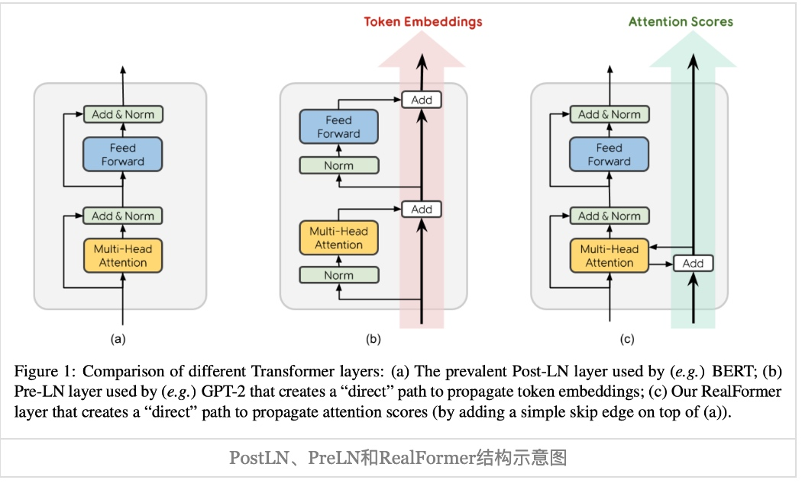

# RealFormer-谷歌
论文标题: RealFormer: Transformer Likes Residual Attention, 作者: Ruining He, Anirudh Ravula, Bhargav Kanagal, Joshua Ainslie, 时间: 2021年9月10日, 核心算法名: RealFormer, 论文链接: [arXiv:2012.11747](https://arxiv.org/abs/2012.11747)

## 背景
Transformer是现代自然语言处理（NLP）模型的基础。然而，尽管Transformer在许多任务中表现出色，但其设计和实现仍有改进的空间。本文提出了一种名为RealFormer的新技术，该技术通过在Transformer网络中创建残差注意层（Residual Attention Layer）来改进Transformer的性能。

## 解决问题
RealFormer的目标是改进Transformer网络的性能，使其在各种任务中表现更好。这些任务包括Masked Language Modeling、GLUE、SQuAD、Neural Machine Translation、WikiHop、HotpotQA、Natural Questions和OpenKP等。此外，RealFormer还旨在稳定训练过程，并使模型的注意力更加稀疏。
<!-- more -->
## 相关工作
Transformer最初由Vaswani等人在2017年提出，用于神经机器翻译（NMT），并从此深刻改变了NLP领域。此后，许多工作都在探索如何改进Transformer，包括提出更好的自我监督目标、使用更大的预训练数据和更好的超参数、模型参数共享、多任务预训练等。这些工作通常采用Post-LN Transformer作为其核心。在本文中，我们采用BERT来测试不同的Transformer架构，因为它被广泛使用并具有代表性。

## 核心方法和步骤


```math 
\begin{equation}
Attention(\boldsymbol{Q}_n,\boldsymbol{K}_n,\boldsymbol{V}_n) = softmax\left(\boldsymbol{A}_n\right)\boldsymbol{V}_n,\quad \boldsymbol{A}_n=\frac{\boldsymbol{Q}_n\boldsymbol{K}_n^{\top}}{\sqrt{d_k}}
\end{equation}
```
变成如下形式:a

```math
\begin{equation}
Attention(\boldsymbol{Q}_n,\boldsymbol{K}_n,\boldsymbol{V}_n) = softmax\left(\boldsymbol{A}_n\right)\boldsymbol{V}_n,\quad \boldsymbol{A}_n=\frac{\boldsymbol{Q}_n\boldsymbol{K}_n^{\top}}{\sqrt{d_k}} + \boldsymbol{A}_{n-1}
\end{equation}
```
1. RealFormer的核心是在Transformer网络中创建一个“直接”路径，以传播原始注意力分数。这通过在每个RealFormer层中添加“残差分数”（以与常规Transformer中的注意力分数相同的方式计算）来实现。然后，这两个分数的和被用来通过softmax计算注意力概率。
2. 实际上，RealFormer可以被看作是在基础Transformer上添加了简单的跳过连接。由于它不添加昂贵的乘法操作，因此预期性能将是可比较的。注意，我们的技术也可以直接应用于不同的Transformer变体。

## 工作对比
- RealFormer与其他工作的主要区别在于，它通过创建残差注意层来改进Transformer网络，这是一种新颖的方法。
- 在各种任务中，包括Masked Language Modeling、GLUE、SQuAD、Neural Machine Translation、WikiHop、HotpotQA、Natural Questions和OpenKP等，RealFormer都显著优于标准的Transformer和其变体（如BERT、ETC等）。