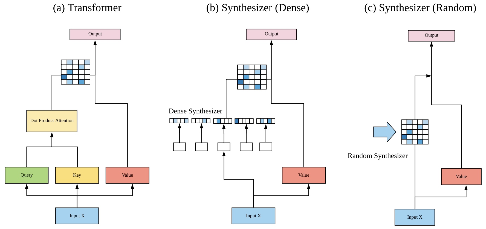

# Synthesizer: Rethinking Self-Attention for Transformer Models (Google Research)
论文标题: Synthesizer: Rethinking Self-Attention for Transformer Models, 作者: Yi Tay, Dara Bahri, Donald Metzler, Da-Cheng Juan, Zhe Zhao, Che Zheng, 时间: 2020, 核心算法名: Synthesizer, 论文链接: [https://arxiv.org/pdf/2005.00743.pdf](https://arxiv.org/pdf/2005.00743.pdf)

## 背景
Transformer模型（Vaswani等人，2017）在各种任务中都表现出了成功，这使得Transformer在近年来大大取代了一度流行的自回归和循环模型。Transformer模型的核心是查询-键-值点积注意力。Transformer模型的成功广泛地归因于这种自注意力机制，因为全连接的token图能够模型长距离依赖性，提供了强大的归纳偏见。但是，这篇论文质疑点积自注意力的真正重要性，并通过大量实验发现，随机对齐矩阵的表现出奇地好，而从token-token（查询-键）交互中学习注意力权重虽然有用，但并不那么重要。

## 解决问题
为了解决这个问题，作者提出了Synthesizer，一种无需token-token交互就能学习合成注意力权重的模型。实验结果显示，简单的Synthesizer在与vanilla Transformer模型的比较中，在一系列任务上都取得了高度竞争性的性能，包括机器翻译、语言建模、文本生成和GLUE/SuperGLUE基准测试。当与点积注意力组合时，作者发现Synthesizer始终优于Transformers。此外，作者还对Synthesizer与Dynamic Convolutions进行了额外的比较，结果显示，简单的Random Synthesizer不仅比Dynamic Convolutions快60%，而且还将困惑度提高了相对3.5%。
<!-- more -->
## 相关工作
注意力模型被广泛应用于各种问题领域，尤其是在语言和视觉领域，这些模型因其有效性而受到欢迎。注意力模型可以追溯到机器翻译模型（Bahdanau等人，2014年；Luong等人，2015年），在这些模型中，注意力被用来学习语言对之间的软对齐。自注意力的基本角色是学习自对齐，即确定单个token相对于序列中所有其他token的相对重要性。然而，这篇论文提出，我们不仅可以不使用点积自注意力，而且也可以完全不使用基于内容的记忆式自注意力。

## 核心方法和步骤

1. **Dense Synthesizer**: 这是最简单的SYNTHESIZER模型变体，它依赖于每个输入token。该方法接受一个输入Xh,` ∈ RN×d，并产生一个输出Yh,` ∈ RN×d。这里，`表示序列长度，d表示模型的维度。首先，我们采用Fh,` (.)，一个参数化的函数，用于将输入Xi从d维度投影到N维度。然后，给定Bi,h,` ∈ RN×N，我们现在计算Yh,` = softmax(Bh,` )Gh,` (Xh,` )，其中Gh,` (.)是另一个参数化函数，类似于标准Transformer模型中的Vh,` (值)。这种方法通过将标准Transformers中的Qh,` Kh,` >替换为合成函数Fh,` (.)，消除了点积注意力Y = softmax(Qh,` Kh,` >)Vh,`。

2. **Random Synthesizer**: 这是另一个SYNTHESIZER的变体，其中注意力权重不依赖于任何输入token。相反，注意力权重被初始化为随机值。这些值可以是可训练的，也可以保持固定。给定一个随机初始化的矩阵Rh,`，Random Synthesizer定义为Yh,` = softmax(Rh,` )Gh,` (Xh,` )。这里，Rh,` ∈ RN×N。每个头部都向网络添加了N 2个参数。Random Synthesizer的基本思想是不依赖于token-token交互或任何来自单个token的信息，而是学习一个在许多样本中全局工作良好的任务特定对齐。

## 工作对比
- 和其他工作一个典型工作的方法区别是什么：Synthesizer的主要区别在于它不依赖于token-token交互来学

习注意力权重，而是直接合成对齐矩阵。这种方法提供了一种新的学习注意力的方式，不需要显式地进行注意力（即，没有点积注意力或基于内容的注意力）。相反，我们生成对齐矩阵，而不依赖于token-token依赖性，并探索了一系列参数化函数来合成注意力矩阵。
- 实验效果对比：在大规模的C4数据集（Raffel等人，2019）上进行的遮罩语言建模和在SuperGLUE和GLUE基准测试上的微调中，我们显示出简单的随机Synthesizers可以胜过/匹配Lightweight Dynamic convolutions（Wu等人，2019）以及胜过Transformers和Universal Transformers（Dehghani等人，2018）。在两个编码任务中，分解的随机Synthesizers胜过低秩的Linformers（Wang等人，2020）。