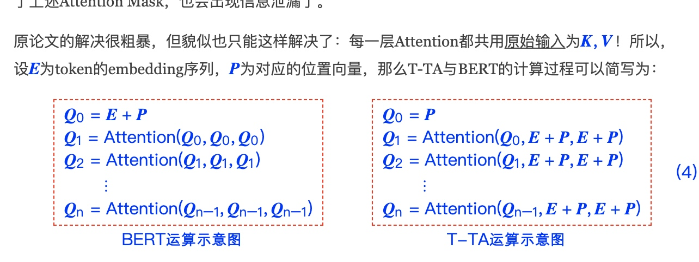

# T-TA (Transformer-based Text Autoencoder)
论文标题: Fast and Accurate Deep Bidirectional Language Representations for Unsupervised Learning, 作者: Joongbo Shin, Yoonhyung Lee, Seunghyun Yoon, Kyomin Jung, 时间: 2020年4月, 核心算法名: Transformer-based Text Autoencoder (T-TA), 论文链接: [https://arxiv.org/abs/2004.08097](https://arxiv.org/abs/2004.08097)

## 背景
尽管BERT在各种监督学习任务中取得了成功的性能提升，但将BERT应用于无监督任务仍然存在一个限制，即它需要重复推理以计算上下文语言表示。为了解决这个限制，我们提出了一种名为Transformer-based Text Autoencoder (T-TA)的新型深度双向语言模型。T-TA可以无重复地计算上下文语言表示，并具有像BERT一样的深度双向架构的优点。

## 解决问题
在CPU环境的运行时实验中，我们提出的T-TA在重排任务中的性能比基于BERT的模型快6倍多，在语义相似性任务中快12倍。此外，T-TA在上述任务中显示出与BERT相比的竞争甚至更好的准确性。
<!-- more -->
## 相关工作
- BERT和其变体在学习自然语言表示方面取得了显著的改进，并在各种下游任务如GLUE基准测试和问题回答等方面取得了最先进的性能。
- 对于无监督任务，研究人员采用了最近的语言表示模型，并研究了它们的有效性。token一个典型的例子是ASR和NMT任务的N-best列表重排。
- 另一方面的研究包括减少BERT的计算时间和内存消耗。Lan等人提出了参数减少技术，实现了18倍的参数减少和1.7倍的训练时间加速。

## 核心方法和步骤

1. **语言自编码(LAE)**: 我们提出了一种新的学习目标，称为语言自编码(LAE)，用于无重复地获取完全上下文化的语言表示。LAE使输出变得与输入相同，目标是一次预测文本序列中的每个token，而不仅仅是将输入复制到输出。为了完成这个任务，语言模型应该在避免过拟合的同时复制整个输入。否则，模型只会输出从输入表示复制的表示，而不学习语言的任何统计信息。为此，从i-th输入到i-th输出的信息流应该在模型内部被阻止。

2. **基于Transformer的文本自编码器(T-TA)**: 我们介绍了一种新的深度双向语言模型的架构，称为T-TA，即基于Transformer的文本自编码器。为了学习提出的LAE，我们在T-TA内部开发了一个对角线遮蔽操作和一个输入隔离机制。这两个组件使得提出的T-TA能够一次计算上下文化的语言表示，同时保持BERT的深度双向属性。

## 工作对比
- 和其他工作一个典型工作的方法区别是什么: 与BERT相比，T-TA在无监督任务中的运行时间更短，性能更好。在CPU环境的运行时实验中，我们提出的T-TA在重排任务中的性能比基于BERT的模型快6倍多，在语义相似性任务中快12倍。此外，T-TA在上述任务中显示出与BERT相比的竞争甚至更好的准确性。
- 实验效果对比: 在重排任务中，即使在更快的推理中，T-TA也能达到与BERT竞争的性能。此外，T-TA在无监督的语义文本相似性任务中的表现优于BERT，Pearson's r得分高达8点。